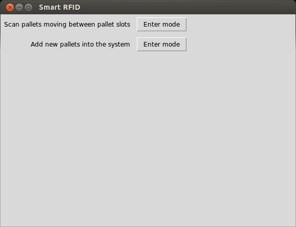
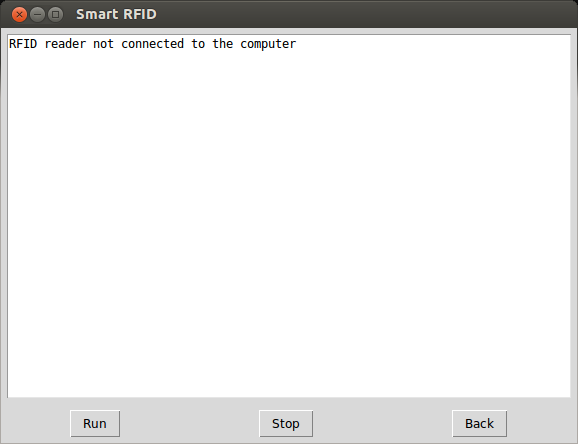

# Implementation of the client in Python

## Requirements

* Python 3
* GCC
* Tk

## Files

* **forklift.py**: Contains state variables related to the forklift.
* **gui.py**: Execute this file to launch the program's GUI.
* **moves_queue.py**: A buffer of moves that haven't been submitted to the
  server yet.
* **move_submitter.py**: A separate thread that handles submitting moves from
  the MoveQueue to the server.
* **README.md**: This file.
* **rfidcom.c**: The file that communicates with the RFID reader. Originally
  from the C client directory, but with a minor modification.
* **rfid_reader.py**: Wraps rfidcom.c.
* **run.py**: The main file which starts the program and where the main loop
  resides.
* **server_api.py**: Has subclasses of `urllib.request.Request` to abstract
  away some of the details when making a request to the server.

## Set up

Start with compiling the C file that communicates with the RFID reader to an
object file:

    gcc -c -fPIC rfidcom.c -o rfidcom.o

The `-c` option says not to run the linker.  
`-fPIC` enables Position Independent Code, read more on
<http://stackoverflow.com/questions/5311515/gcc-fpic-option>.

Then create a shared object:

    gcc -shared rfidcom.o -o rfidcom.so

Tk and Tkinter are also needed for being able to run the GUI program
([gui.py](gui.py)). Install this dependency with the following command on
Debian and Ubuntu:

    sudo apt-get install python3-tk

If you don't want to run the program as root with `sudo`, add yourself to the
group `dialout`:

    sudo gpasswd -a $USER dialout

Don't forget that you have to log out and in for the change to take effect.

## Run

### Command-line

    $ ./run.py --help
    Usage: run.py [options]

    A client with two modes. Either to register moved pallets or to delete tags
    (belonging to pallets or pallet slots) from the server.

    Options:
      -h, --help            show this help message and exit
      -m (delete|move), --mode=(delete|move)
                            set the mode the program should run in
    $ ./run.py -m move
    RFID reader not connected to the computer

### GUI

    $ ./gui.py
